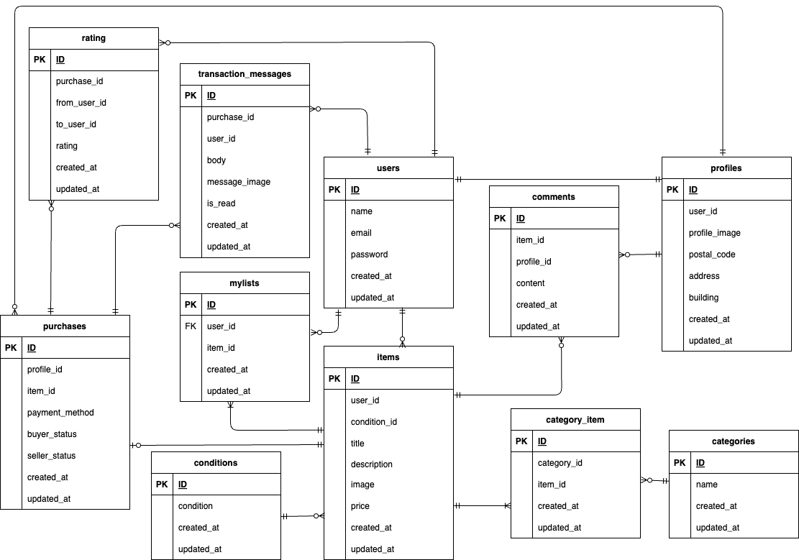

# marketplace-app
## 環境構築
### Dockerビルド
1. git clone git@github.com:saaya0401/marketplace-app.git
1. docker-compose up -d --build

### Laravel環境構築
1. docker-compose exec php bash
1. composer install
1. cp .env.example .env
1. .envファイルの一部を以下のように編集
```
APP_TIMEZONE=Asia/Tokyo

DB_CONNECTION=mysql
DB_HOST=mysql
DB_DATABASE=laravel_db
DB_USERNAME=laravel_user
DB_PASSWORD=laravel_pass

QUEUE_CONNECTION=sync

MAIL_MAILER=smtp
MAIL_HOST=mailhog
MAIL_PORT=1025
MAIL_FROM_ADDRESS="marketplace@example.com"

STRIPE_KEY=pk_test_51QsIBBGCkm4oaUW7wkur63PFKOydrNQR1rDXkRX8mI6lZS95aohBAtlipz981yA4ROSE6wUqNAeKV4bkjPmOAUX100ZCIEWA4u
STRIPE_SECRET=sk_test_51QsIBBGCkm4oaUW7rsfBWuStvboPUrYlEtmIBGj3I9XgXxrJyjbpd0dlYxszD9YVE0mKH6EKqPopRdVTfhMQzBlv00jlOwFb6p
```

5. php artisan config:clear
1. php artisan storage:link
1. php artisan key:generate
1. php artisan migrate
1. php artisan db:seed
1. php artisan config:cache

## 前半の商品を出品したユーザのログインデータ
- メールアドレス: saaya@example.com
- パスワード: saayakoba

## 後半の商品を出品したユーザのログインデータ
- メールアドレス: hiyori@example.com
- パスワード: hiyorikoba

## 商品を出品していないユーザのログインデータ
- メールアドレス: koharu@example.com
- パスワード: koharukoba

## カード払いのテストカード
- 番号: 4242 4242 4242 4242
- 日付: 任意の将来の日付
- セキュリティコード: 任意の3桁の数字

## URL
- 環境開発: http://localhost/
- phpMyAdmin: http://localhost:8080/
- MailHog: http://localhost:8025

## テスト手順
1. テスト用データベースの作成
```
1. docker-compose exec mysql bash
2. mysql -u root -p
3. passwordを求められたらrootと入力する
4. CREATE DATABASE demo_test;
```
2. docker-compose exec php bash
1. php artisan config:clear
1. php artisan key:generate --env=testing
1. php artisan migrate --env=testing
1. php artisan config:cache
1. php artisan test

*php artisan test でまとめてテストするとエラーになる場合は個別にテストしてください

8. php artisan test --filter RegisterTest
1. php artisan test --filter LoginTest
1. php artisan test --filter LogoutTest
1. php artisan test --filter ItemTest
1. php artisan test --filter MylistTest
1. php artisan test --filter SearchTest
1. php artisan test --filter DetailTest
1. php artisan test --filter MylistActionTest
1. php artisan test --filter CommentTest
1. php artisan test --filter PurchaseTest
1. php artisan test --filter PaymentMethodTest
1. php artisan test --filter AddressTest
1. php artisan test --filter ProfileTest
1. php artisan test --filter ProfileUpdateTest
1. php artisan test --filter SellTest

## 使用技術
- MySQL 8.0.26
- PHP 8.2-fpm
- Laravel 11

## ER図

